# WhatsApp SaaS Platform — System Architecture & Flowcharts

## SECTION 1 — High-Level Architecture

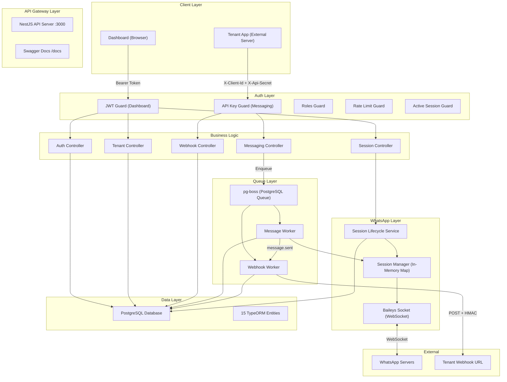

---

## SECTION 2 — User Flows

### Flow 1: Super Admin — Create Tenant

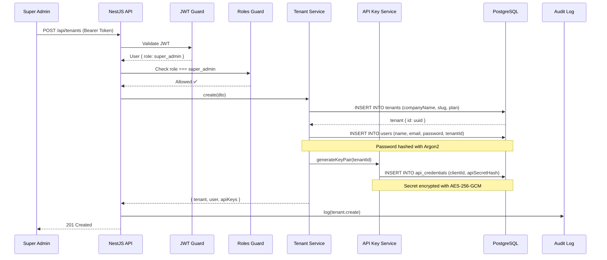

### Flow 2: Tenant Onboarding — QR Scan + OTP Verification

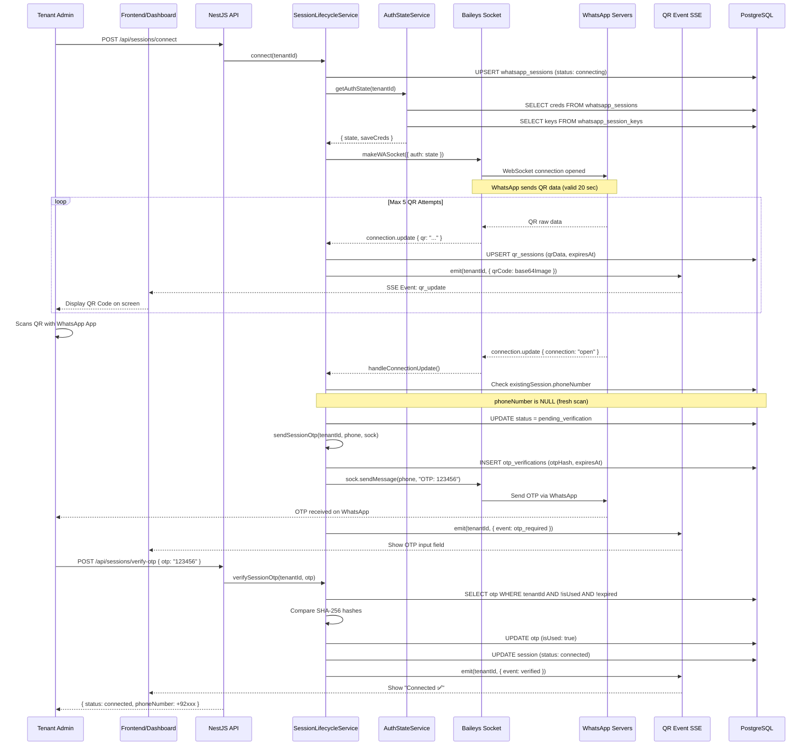

### Flow 3: API Message Sending — Complete Lifecycle

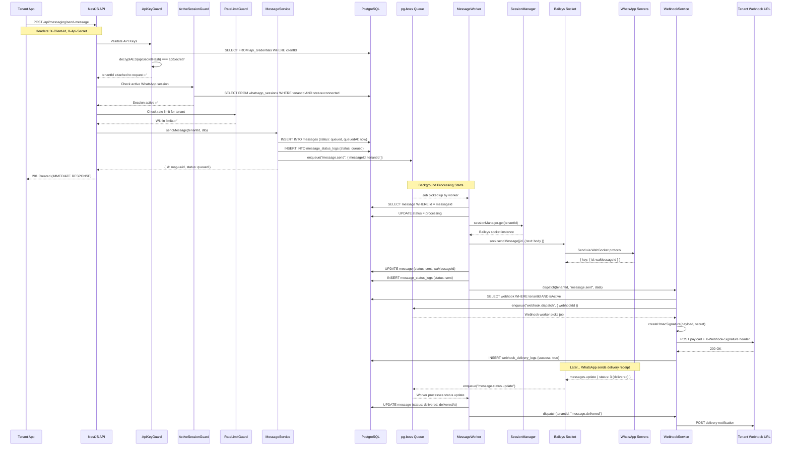

### Flow 4: Incoming Message Flow

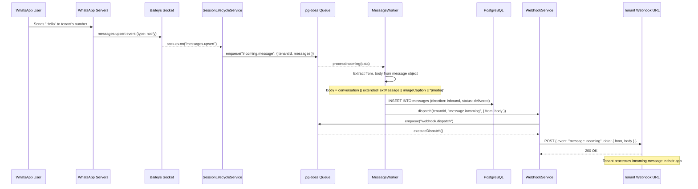

### Flow 5: Session Reconnect & Disconnect

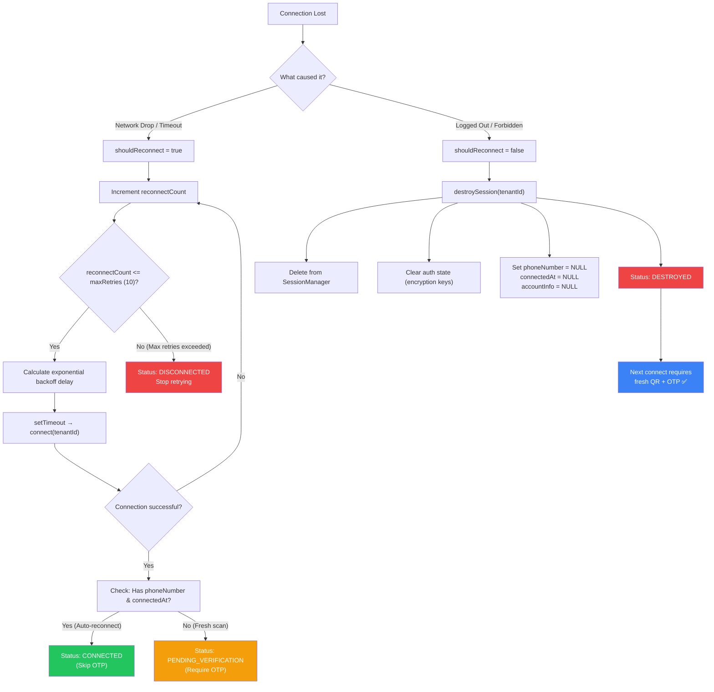

---

## SECTION 3 — NestJS Request Lifecycle

Every HTTP request passes through this pipeline:

```mermaid
flowchart LR
    A["HTTP Request"] --> B["Helmet\n(Security Headers)"]
    B --> C["CORS\n(Origin Check)"]
    C --> D["Global Prefix\n(/api/)"]
    D --> E["LoggingInterceptor\n(Log request start)"]
    E --> F["TimeoutInterceptor\n(30s max)"]
    F --> G["Guards"]

    subgraph Guards["Guard Layer (Authentication & Authorization)"]
        G1["JwtAuthGuard\n(Bearer Token)"]
        G2["ApiKeyGuard\n(X-Client-Id + Secret)"]
        G3["RolesGuard\n(super_admin check)"]
        G4["ActiveSessionGuard\n(WhatsApp connected?)"]
        G5["RateLimitGuard\n(Per-tenant throttle)"]
    end

    G --> H["ValidationPipe"]
    H --> I["Controller Method"]
    I --> J["Service Layer"]
    J --> K["Repository / TypeORM"]
    K --> L["PostgreSQL"]

    L --> M["Response Data"]
    M --> N["ResponseTransformInterceptor"]
    N --> O["Wrap in { success, data, meta }"]
    O --> P["HTTP Response"]

    style G1 fill:#3b82f6,color:#fff
    style G2 fill:#8b5cf6,color:#fff
    style G3 fill:#f59e0b,color:#fff
    style G4 fill:#22c55e,color:#fff
    style G5 fill:#ef4444,color:#fff
```

### Guard Decision Matrix

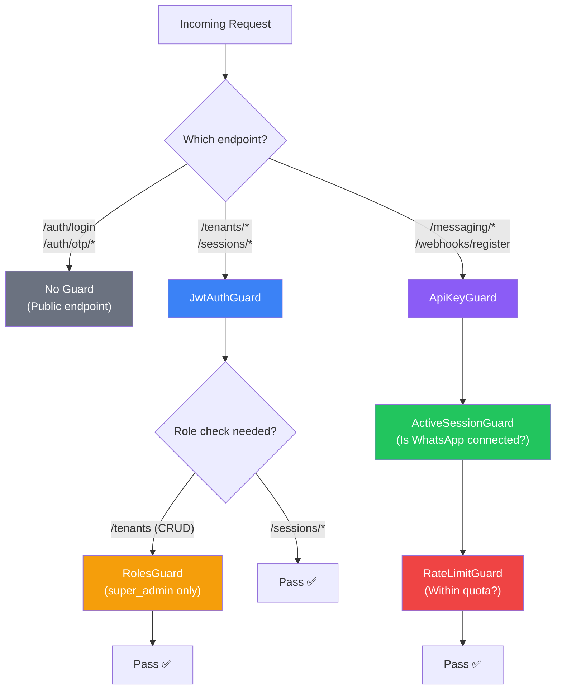

## SECTION 4 — Database Entity Relationships

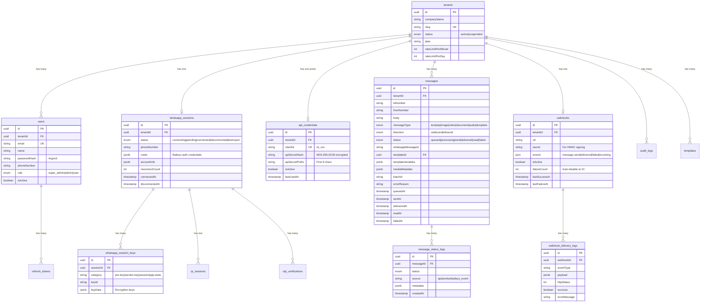

### Multi-Tenant Data Isolation

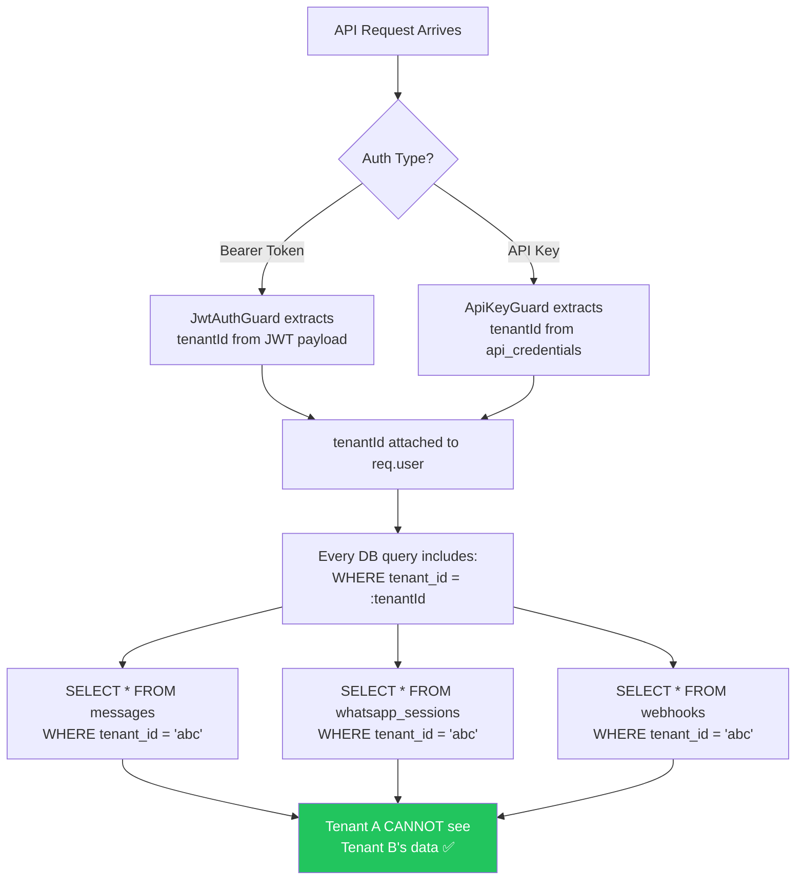

---

## SECTION 5 — Queue Architecture

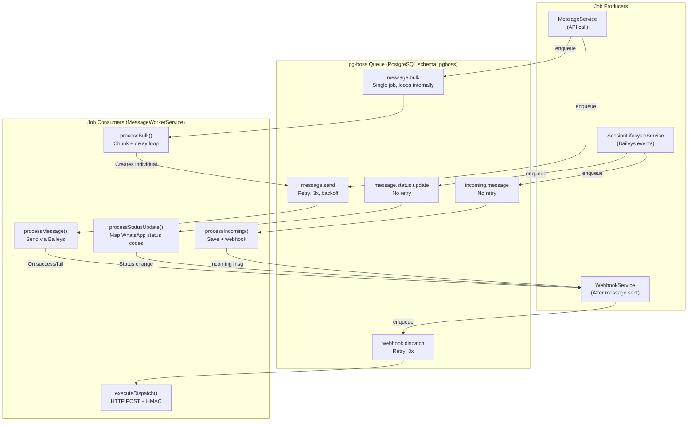

### Message Status State Machine

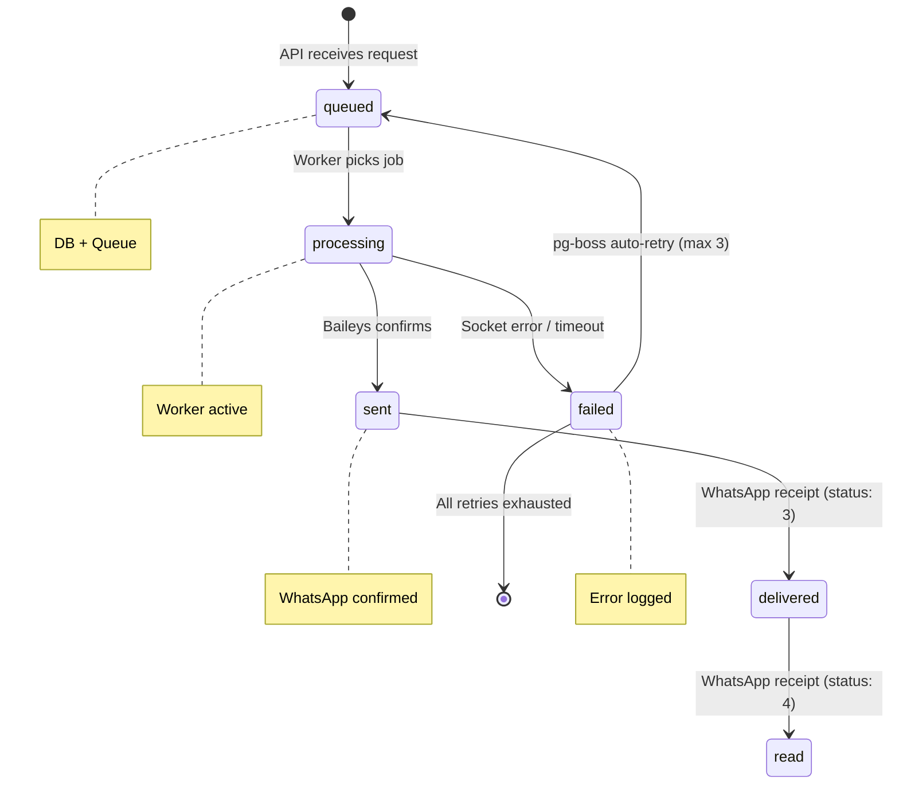

### Bulk Message Processing

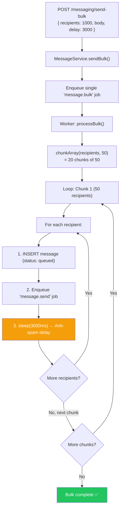

---

## SECTION 6 — Authentication Architecture

```mermaid
flowchart TD
    subgraph "Dashboard Auth (Human Users)"
        L1["Email + Password Login"] --> V1["Argon2 verify hash"]
        L2["WhatsApp OTP Login"] --> V2["SHA-256 verify hash"]
        V1 --> T1["Issue JWT Access Token (15 min)"]
        V2 --> T1
        T1 --> T2["Issue Refresh Token (7 days)"]
        T2 --> DB1["Store hashed refresh token in DB"]
    end

    subgraph "API Auth (Server-to-Server)"
        L3["X-Client-Id + X-Api-Secret\nin HTTP Headers"] --> V3["ApiKeyGuard"]
        V3 --> D1["SELECT FROM api_credentials\nWHERE clientId"]
        D1 --> D2["decryptAES(apiSecretHash, ENCRYPTION_KEY)"]
        D2 --> D3{"decrypted === provided secret?"}
        D3 -->|"Yes"| D4["Attach tenantId to request ✅"]
        D3 -->|"No"| D5["401 Unauthorized ❌"]
    end

    subgraph "API Key Lifecycle"
        G1["POST /auth/api-keys/rotate"] --> G2["Invalidate old keys\n(isActive: false)"]
        G2 --> G3["Generate new clientId + secret"]
        G3 --> G4["Encrypt with AES-256-GCM"]
        G4 --> G5["Store encrypted in DB"]

        VW1["POST /auth/api-keys/view/request-otp"] --> VW2["Send OTP to phone"]
        VW2 --> VW3["POST /auth/api-keys/view/verify"]
        VW3 --> VW4["Verify OTP"]
        VW4 --> VW5["Decrypt AES → Show clientId + secret"]
    end
```

---

## SECTION 7 — Production Trade-offs

### 1. Why pg-boss (PostgreSQL Queue) instead of Redis/RabbitMQ?

| Factor | pg-boss (Our Choice) | Redis (Bull) | RabbitMQ |
|--------|---------------------|--------------|----------|
| **Extra infra needed** | ❌ No (uses existing PostgreSQL) | ✅ Yes (Redis server) | ✅ Yes (RabbitMQ server) |
| **Transactional safety** | ✅ Same DB transaction | ❌ Separate system | ❌ Separate system |
| **Persistence** | ✅ Disk-backed | ⚠️ Memory (can lose data) | ✅ Disk-backed |
| **Throughput** | ~1,000 jobs/sec | ~10,000 jobs/sec | ~5,000 jobs/sec |
| **Complexity** | Low | Medium | High |

> **Why this design?** For a WhatsApp SaaS, throughput of 1,000 msgs/sec is MORE than enough (WhatsApp bans above ~50 msgs/min anyway). Using pg-boss means zero extra infrastructure and atomic transactions with our message table.

> **When to switch?** If you scale beyond 50+ concurrent tenants each sending 1,000+ messages simultaneously, migrate to Redis + Bull.

### 2. Why Baileys instead of Meta Official API?

| Factor | Baileys (Our Choice) | Meta Cloud API |
|--------|---------------------|----------------|
| **Cost** | Free | $0.04-$0.08 per conversation |
| **Setup** | QR scan (2 minutes) | Business verification (2-4 weeks) |
| **Templates** | No approval needed | Every template needs Meta approval |
| **Rate limits** | Enforced by us (queue) | Enforced by Meta |

### 3. Why AES-256 for API Secrets instead of Argon2?

| Factor | AES-256-GCM (Our Choice) | Argon2 (Previous) |
|--------|-------------------------|-------------------|
| **Reversible** | ✅ Yes (can decrypt) | ❌ No (one-way hash) |
| **View API keys** | ✅ Possible after OTP | ❌ Impossible |
| **Security at rest** | ✅ Encrypted | ✅ Hashed |
| **Key dependency** | ⚠️ ENCRYPTION_KEY env var | None |

> **Trade-off:** We chose AES so tenants can VIEW their keys via OTP verification. If ENCRYPTION_KEY is lost, ALL API secrets become irrecoverable. Must be stored in a secure vault (AWS Secrets Manager / HashiCorp Vault).

### 4. Why Store Baileys Auth in PostgreSQL instead of Files?

| Factor | PostgreSQL (Our Choice) | File System |
|--------|------------------------|-------------|
| **Multi-server** | ✅ Shared across instances | ❌ Local only |
| **Backup** | ✅ pg_dump includes it | ⚠️ Separate backup |
| **Recovery** | ✅ DB restore = sessions restore | ❌ Files lost = QR rescan |
| **Performance** | ⚠️ JSONB read/write overhead | ✅ Direct file I/O |

> **Trade-off:** Slight performance overhead but essential for horizontal scaling and disaster recovery.

---

## SECTION 8 — Production Engineering Concerns

### 1. Session Security
- Auth credentials stored as **JSONB** in PostgreSQL (encrypted at DB level via PostgreSQL TDE in production).
- Encryption keys (`whatsapp_session_keys`) are device-specific — stealing them without the creds is useless.
- OTP verification on fresh QR scans prevents unauthorized device linking.
- `destroySession()` clears all keys, creds, phoneNumber, and connectedAt.

### 2. Webhook Reliability
```
Attempt 1: POST → Tenant server → Timeout/500
  → Log failure, failureCount = 1

Attempt 2 (pg-boss retry): POST → Tenant server → Timeout
  → failureCount = 2

...continue until...

Attempt 10: failureCount = 10
  → SET isActive = false (auto-disable webhook)
  → No more deliveries until tenant re-registers
```

### 3. Queue Failure Recovery
- `message.send` jobs have `retryLimit: 3, retryDelay: 5000, retryBackoff: true`.
- After 3 retries, message status set to `failed` with `errorReason`.
- pg-boss automatically archives completed jobs after 12 hours (`QUEUE_ARCHIVE_AFTER=43200`).
- Archived jobs deleted after 7 days (`QUEUE_DELETE_AFTER=604800`).

### 4. N+1 Query Prevention
- `ApiKeyGuard` uses `relations: ['tenant']` to eager-load tenant in one query.
- `MessageWorkerService` processes one message per job (no batch loading needed).
- Bulk operations use `chunkArray(recipients, 50)` to prevent memory overflow.

### 5. Horizontal Scaling Challenges

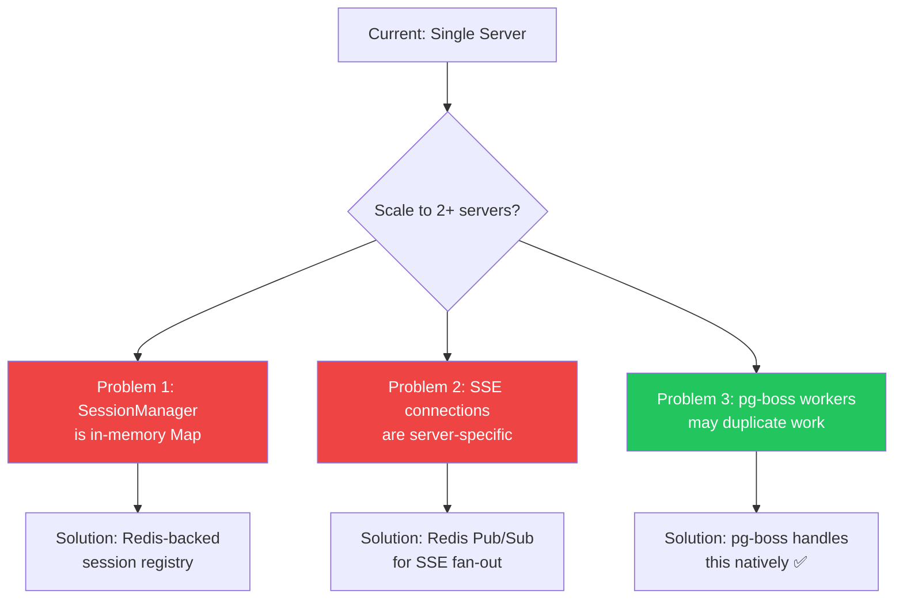

> **Key Bottleneck:** `SessionManagerService` stores Baileys sockets in a JavaScript `Map`. This means all WhatsApp connections for all tenants MUST live on the same server. To scale horizontally, you'd need a "sticky session" load balancer or a dedicated WhatsApp gateway service.

### 6. Database Bottlenecks
- **messages table** is the fastest-growing table. Add `created_at` index + partitioning by month for 1M+ rows.
- **whatsapp_session_keys** can grow to 500+ rows per tenant. CASCADE delete on session destroy handles cleanup.
- **webhook_delivery_logs** should be purged periodically (implement a scheduled pg-boss job).

### 7. WhatsApp Disconnect Handling

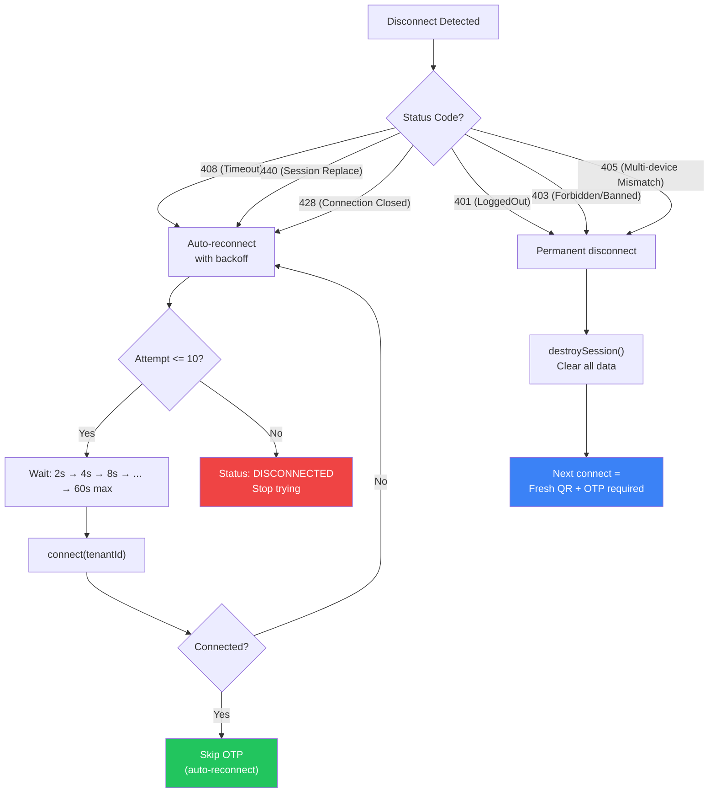

### 8. Rate Limiting Strategy

| Layer | What It Protects | How |
|-------|-----------------|-----|
| **RateLimitGuard** | API endpoint abuse | Per-tenant request count per minute |
| **Bulk delay** | WhatsApp ban prevention | `sleep(batchDelay)` between messages |
| **OTP rate limit** | OTP spam prevention | Max 3 OTPs per phone per 10 minutes |
| **Webhook auto-disable** | Infinite retry loops | Disable after 10 consecutive failures |
| **QR max attempts** | Resource exhaustion | Max 5 QR codes per connect attempt |
| **Reconnect max retries** | CPU/memory exhaustion | Max 10 reconnect attempts |
